# Viverse Unity SDK for WebGL

A Unity SDK for integrating Viverse functionality into WebGL applications, including avatar rendering, leaderboards, and SSO capabilities.

## Prerequisites

- Unity 6.x LTS (tested with 6000.0.34f1)
- Unity WebGL Build Support Module
- Windows Operating System (mac support coming soon)
- [mkcert](https://github.com/FiloSottile/mkcert) installed globally
  - ensure that you can open a terminal and can run "mkcert -version" in it successfully
  - requires reboot for unity to pick up the new path after it's installed
- Administrator access (for hosts file modification)
- Importing samples and testing the ConfigurableDriver as your first scene is highly recommended, it allows you to test with sample credentials for your app
  - Some sample credentials if you do not have any for testing are:
    - clientid: 3c3e8325-db8f-4a77-a66b-c189c500b0ad
    - appid for leaderboards:  64aa6613-4e6c-4db4-b270-67744e953ce0
    - leaderboard name: test_leaderboard - which was created with options: sort decending, numeric and append type

## Installation
1. Import package by going to Window/Package Manager and selecting the Package manager
 - 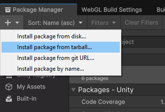
2. Import samples: Select the package "Viverse API For WebGL export" and select the "Samples" tab, then import samples from pacakge in the samples tab
 - 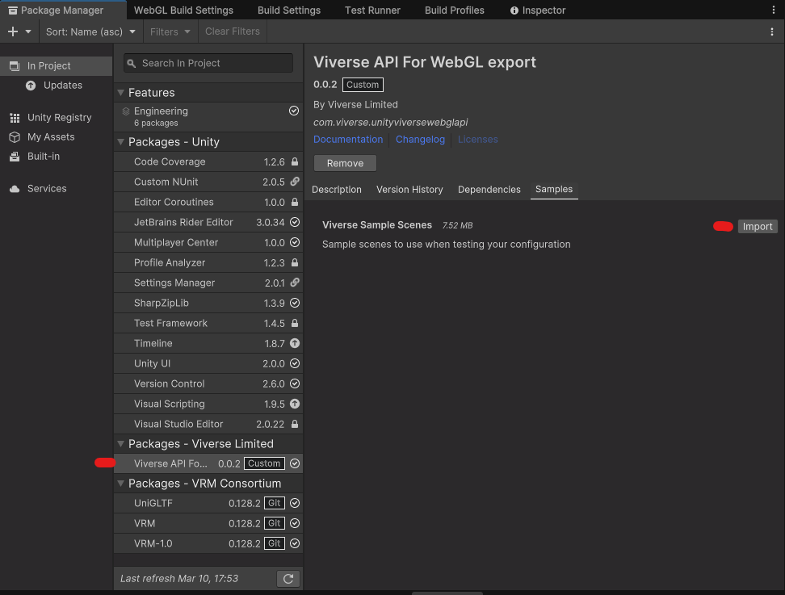

### 1. System Configuration

1. **Configure Hosts File**:
   - Open `C:\Windows\System32\drivers\etc\hosts` as administrator
   - Add: `127.0.0.1 create.viverse.com`
   - This step is necessary to simulate being on the real Viverse domain, which allows your local development server to handle authentication cookies and API requests without CORS issues. The SDK sets up an HTTPS server on your local machine that responds as if it were create.viverse.com.

2. **Verify Port Availability**:
   - Navigate to https://localhost
   - Ensure you see "site cannot be reached" (confirming no other HTTPS server is running)

3. **Install mkcert**:
   - Follow instructions at [mkcert Windows installation](https://github.com/FiloSottile/mkcert?tab=readme-ov-file#windows)
   - Verify installation by running `mkcert -version` in a new terminal
   - 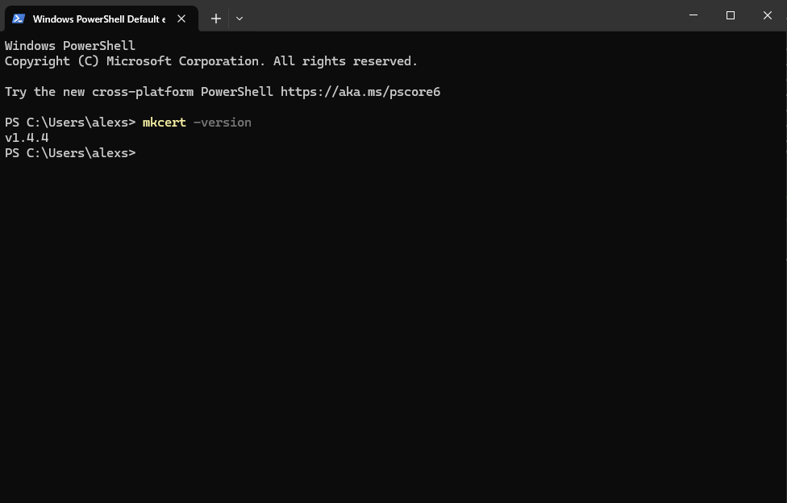
   - Restart your computer if you just added mkcert to PATH
   - mkcert creates locally-trusted development certificates, allowing your local server to use HTTPS which is required for modern authentication flows

### 2. Unity Project Setup

1. **Create/Open Unity Project**:
   - Create a new Unity project or open existing one
   - Import the Viverse SDK package (.tgz)
   - Import included samples for testing

2. **Configure Build Settings**:
   - Switch platform to WebGL
   - Open Tools > WebGL Settings window
   - Click "Apply All Settings" to configure default settings
   - The WebGL Settings window automatically applies the correct project settings for Viverse integration when you select apply all settings and have the checkbox above it checked that disables compression fallback

3. **Configure Build Output**:
   - Create a `Build` folder parallel to `Assets`:
   ```
   PROJECT_ROOT/
   ├── Assets/
   ├── Build/           <- Build output here (name is currently not configurable for early releases)
   ├── Library/
   └── ...
   ```

### 4. VRM Package Setup (Needed for avatar rendering)

1. Open Tools > WebGL Settings
2. Select the "Install VRM Packages" button to install the relevant packages, wait for them to import
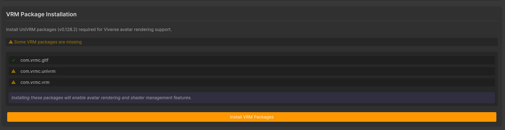
  - If something goes wrong or you want to manage these yourself, install these dependencies
```
https://github.com/vrm-c/UniVRM.git?path=/Assets/UniGLTF#v0.128.2
https://github.com/vrm-c/UniVRM.git?path=/Assets/VRM#v0.128.2
https://github.com/vrm-c/UniVRM.git?path=/Assets/VRM10#v0.128.2
```

### 4. Shader setup
1. Open Tools > WebGL Settings
2. Select "Add Missing Shaders" to add shaders/shader variant collections to your build settings that ensure that viverse avatars will render as expected in a build (as they will get stripped by the webgl export otherwise, but will work in the editor)
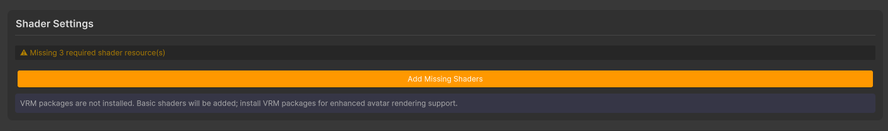

### 5. HTTPS Server Setup

1. Open Tools > WebGL Settings
2. Navigate to the Server Setup section
3. Follow the step-by-step setup process:
   - Install SSL certificate
   - Generate SSL certificate
   - Install Node modules
   - Start HTTPS server
- At the end it should look like this, and have no errors in the console
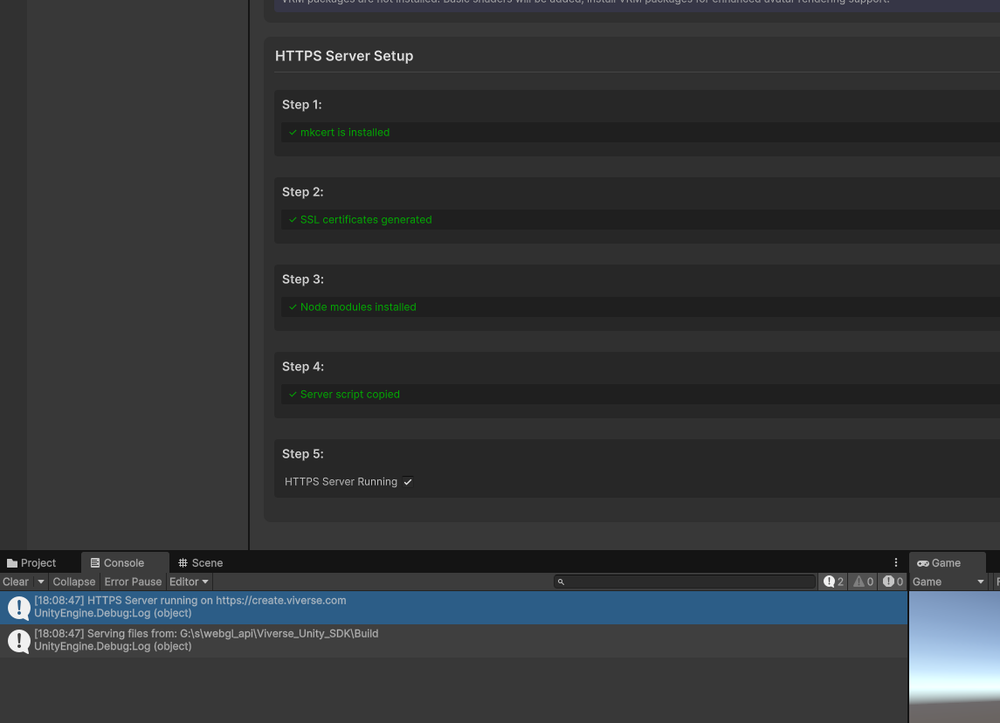
- The HTTPS server serves your WebGL content securely and handles the domain simulation for create.viverse.com

### 7. Build configurable driver scene to Build directory previously made
 - Set the active scene to the ConfigurableDriver test scene from the package manager assets, and build to the "Build" directory we previously made that is parallel to the "Assets" directory of this project
 - 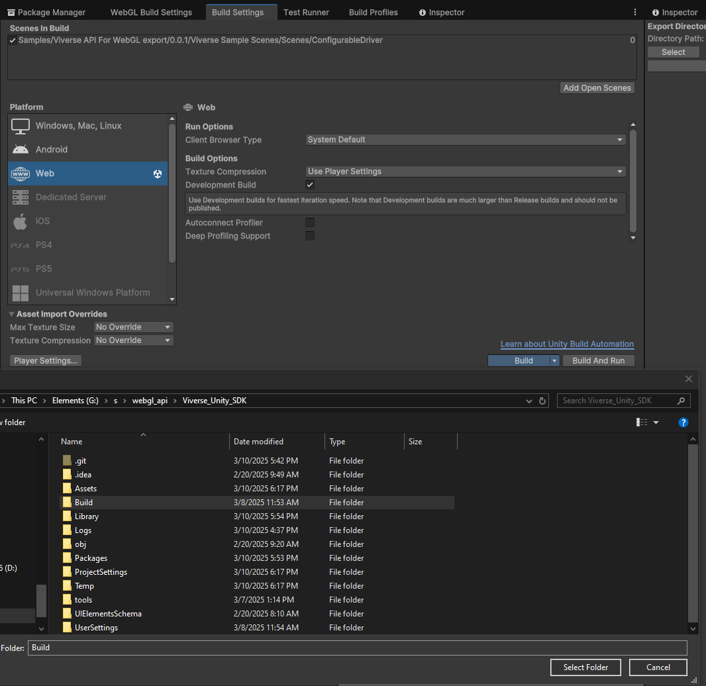
 - Note: the first build will likely take a little while longer than expected - 10-30 minutes is normal
 - Open a new browser instance and go to https://create.viverse.com - you should see logs in the console of your unity editor indicating requests are being served from it, and the configurable driver scene, where you can use test credentials provided in the prerequisites section at the top of this file
- 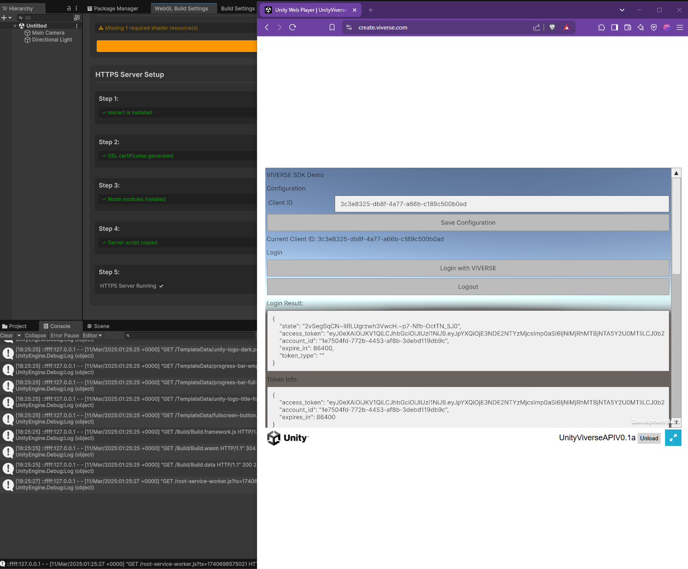

### 8. Leaderboard Configuration (Optional)

1. Create account on [VIVEPORT Developer Console](https://developer.viveport.com/console/titles)
2. Get your VIVEPORT ID from the listing
3. Configure leaderboard names in the VIVEPORT SDK section, using the viveport id as the identifier in the leaderboard section
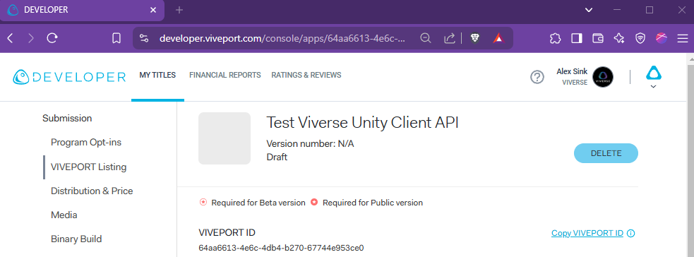

## When to disable the hosts file configuration

You should remove or comment out the hosts file entry (`127.0.0.1 create.viverse.com`) in these scenarios:

1. **Accessing the real Viverse site**: If you need to access the actual create.viverse.com website
2. **After development is complete**: To avoid conflicts once you're done with development
3. **For production deployment**: Your production build will use your actual domain
4. **When encountering conflicts**: If other local development setups use the same domain

To disable, simply edit your hosts file and comment out or remove the line by adding a # at the beginning: `# 127.0.0.1 create.viverse.com`

## Browser Developer Tools for Debugging

When troubleshooting integration issues, browser developer tools can be extremely helpful:

1. **Setting up for debugging**(before loading a page):
   - Right-click on an empty area of the page before loading and select "Inspect" or press F12
     - 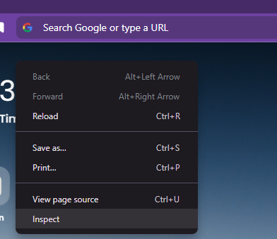
   - Go to the Network tab and check both "Preserve log" and "Disable cache" (if you don't see the settings, select the gear icon that is below the x button in the upper right)
     - 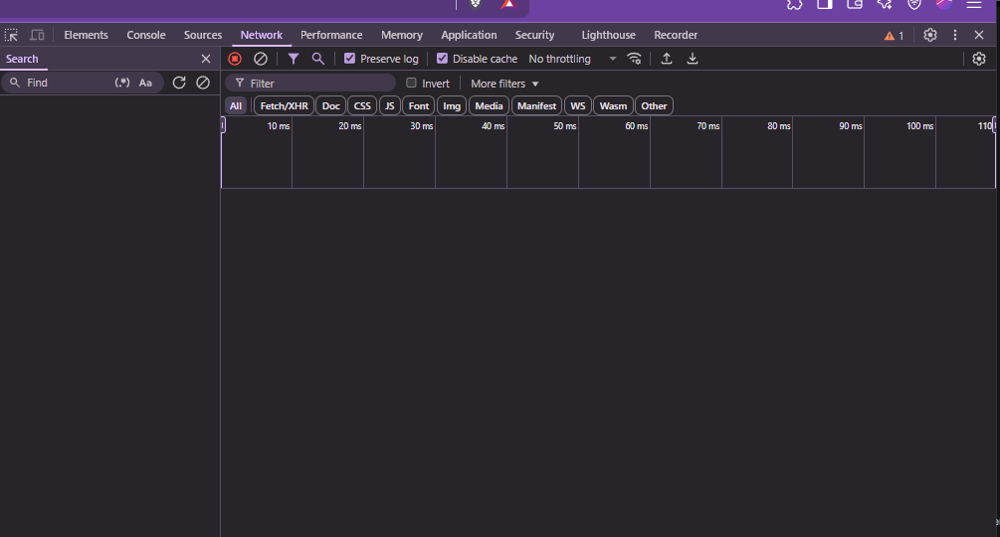
   - Open the Console panel and ensure "Preserve log" is checked
   - 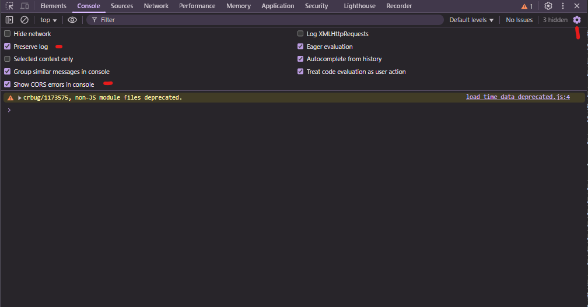
   - Make sure "Show CORS errors" is enabled in console settings as well

2. **What to look for**:
   - Network requests failing with 404 (not found) errors
   - CORS policy violations in the console
   - Authentication-related errors in API responses
   - SSL certificate warnings or errors

The circle with a slash icon can be used to clear the log at any time, and the filter input helps locate specific error messages.

For more comprehensive guides on using browser developer tools:
- [A Web Developer's Guide to Browser Caching](https://medium.com/@steelcityamir/a-web-developers-guide-to-browser-caching-cc41f3b73e7c)
- [One Tab To Rule Them All - The Developer Tools Network Tab](https://www.ministryoftesting.com/articles/one-tab-to-rule-them-all-the-developer-tools-network-tab)

## Known Issues

- Firefox browser not supported (mkcert limitation)
- Build & Run doesn't work directly (build then view in browser instead)
- Login/logout/login sequence redirects to account.viverse.com
- Some avatars may show "ArgumentException: Neutral key already added"
- CORS errors may appear for leaderboard requests (can be ignored)
- CORS errors happen when using achievement APIs currently
   - To test achievements, launch a browser instance with cors disabled
   - For chrome, an example command line(change to match your chrome instance and where an empty folder for the dev session data will be) is:
      - "C:\Program Files (x86)\Google\Chrome\Application\chrome.exe" --user-data-dir="C:/Chrome dev session" --disable-web-security --ignore-certificate-errors --disable-features=StrictOriginWhenCrossOrigin --test-type

## Build Output Structure

After building, your `Build` folder should contain:
```
Build/
├── Build/
│   ├── Build.data
│   ├── Build.framework.js
│   ├── Build.loader.js
│   └── Build.wasm
├── TemplateData/
└── index.html
```

## Troubleshooting

### Testing Configuration
To test the configuration independently of unity project integration, there is a sample Viverse html only page to test that the functionality should work in your environment
1. Import "Viverse html only page" sample, which imports a ViverseAPIIntegrationPage.html page
2. put the html page inside the "Build/" folder
3. navigate to "https://create.viverse.com/ViverseAPIIntegrationPage.html"

### SSL Certificate issues debugging
If you encounter SSL certificate issues:
1. Close Unity and all browser instances
2. Delete the `tools` directory
3. Reopen project
4. Reconfigure HTTPS server in WebGL settings
5. Clear HSTS data if needed:
   - Chrome: chrome://net-internals/#hsts
   - Edge: edge://net-internals/#hsts
   - Firefox: Not supported

### Decompression settings warning shows up in build
1. if you see some popup like this when the app is loading
   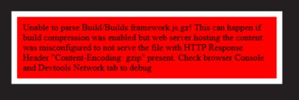
  - make sure the disable decompression fallback checkbox is checked and press apply webgl settings
  - If you still see this, un-check it, check it again and apply webgl settings, and then press save project before building again

### Mkcert not found showing up after installation
- if you see something like this, then you may need to reboot to make sure that unity gets mkcert path
- Remember that macos support is coming soon, so if you're on mac, this is as likely as far as you can go for now
 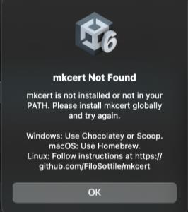

## Version History

See [CHANGELOG.md](CHANGELOG.md) for version history and updates.